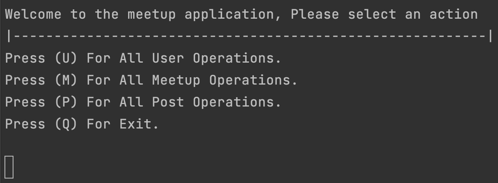
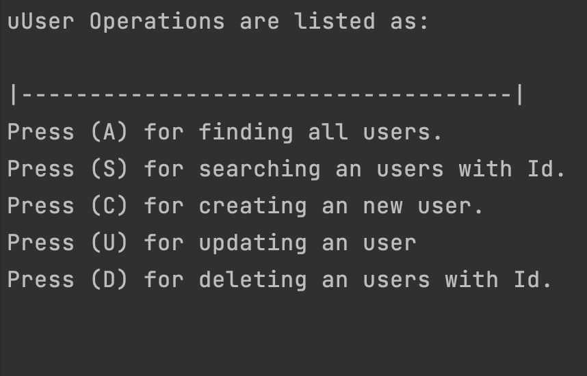
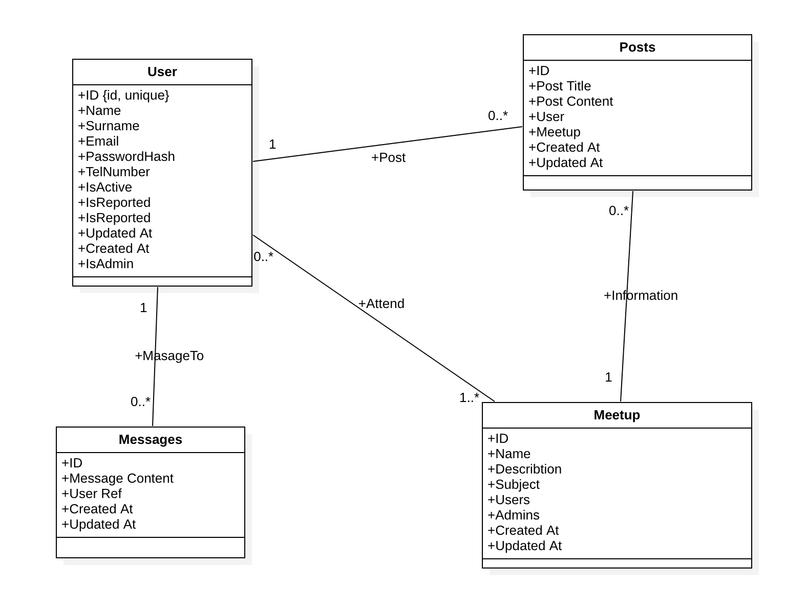

---
title: "Meetup Command Line Application"
author: [M. Semih Celek, 2018100075]
date: "2022-01-08"
subject: "Meetup .Net Application"
keywords: [.Net, Mysql, Database, Command Line]
subtitle: "Bogazici University 2022"
lang: "en"
titlepage: true
toc-own-page: true
titlepage-rule-color: "360049"
titlepage-rule-height: 0
titlepage-background: "background1.pdf"
page-background: "background5.pdf"
...

# Introduction

## System Request:

<!-- \chapter{First} -->
<!-- \section{one} -->

**Business Needs**: There is a need for new socials media application that focuses on creating meetups and creating events. This application aims to fulfill this need.

**Business Values**: The new social media application database system will enable users to create meetups and create posts. Also it will have business values throughout advertisement.

### Objective

Aim of the project is to create a new social media application enabling people to organize events. This events can be at both for online, or physical. Also application will enable its users to communicate on meetup basis so that people can stay in touch.

## Application Features

### User Registration Module

The users of meetup application needs to be registered in order to keep track the actions. Users must add their personal information such as (_Name, Surname, Email Address, Password, Telephone Number, Registration Date, Role, etc..._). Business rules for registration module are listed as;

- The fields of Name, Number, ID, Email, Password and Role cannot be null.
- Role of the user must be specified, whether the user is administrator or user.

### Meetup Module

Users can create meetup instances and invite other people to their meetups. Meetups are small group of users who shares a common feed, communication space.

Business rules are listed as;

- Only Users can create Meetups.
- Meetups have their admins.
- Meetup's feed can only be seen by its members, not member User cannot see the inside of a Meetup.
- Users can attend a meetup by its link and can quit anytime.
- Only admins have privilege to manage users(add, subtract)

### Post Module

Users can create their posts like any other platform Posts are the simple way of user the share their ideas. Post consist of _Title, Content, Date, User Reference and ifExist a Meetup Refernce, Comments Ref_.

Business rules are listed as;

- Only Users can create posts.
- Posts can be posted on both meetup events or publicly.
- Posts that are published on meetup instances can only be viewed by those who attends to the meetup.
- Posts can only be edited by it's user.
- Only User's friends or meetup associates can comment the post, others can't comment.

### Searching Module

Searching Module can be used to search both Users, Meetups and Posts. Users of search module can search every instance of the meetup and user by entering its id.

### Application Interface

Meetup Application is built on command line interface. It offers limited amount of interaction by its nature. In this application We have 1 main menu where we can the entity(User, Meetup, Post) which we want to manipulate and we have 1 sub menu for each entity. We have 5 main operations on each entity. These operations are fundamental create, read, read-all, update and delete operations.

### Screen Shots of Application

Main Menu:



User Sub-Menu:



\pagebreak

# Meetup Command Line Application

<!-- _Mehmet Semih Celek, 2018100075_ -->

## Application

Repo Link: [https://github.com/semihcelek/MeetupApplication](https://github.com/semihcelek/MeetupApplication)

Command line application is written with C# multi-purposed, typed, programming language. Application persist its data with sql database. In this project Mysql database is implemented although other databases can be easily integrated by implementing DataAccess interfaces.

Application consist of 3 major parts, Models, Services, and View.

- Model is where we define data schemas for objects. In the project we have User Model, Meetup Model, and Post Model.

- Services is where we manipulate and iterate the data. It's also where we persist the data by using database, the project uses Mysql database.

- View is where we present data. In the project, command line interface is used.

In the project we have users that interacts with events.

This interaction can be represented with an Uml diagram.



\pagebreak

## Creating Database

Lets start with creating database;

```sql
create database meetupdb;

use meetupdb;

```

After that create user table;

```sql
create table users
(
    id           int unsigned primary key AUTO_INCREMENT,
    name         char(80)           not null,
    surname      char(80)           null,
    email        char(120)          not null unique,
    passwordHash char(255)          not null,
    isActive     bool default true  not null,
    isAdmin      bool default false not null
);

create table meetups
(
    id          int unsigned primary key AUTO_INCREMENT,
    name        char(80)  not null,
    description char(255) null,
    subject     char(120) not null unique,
    createdAt   timestamp not null,
    updatedAt   timestamp null
);

create table meetupMembership
(
    user   int unsigned not null,
    meetup int unsigned not null,
    primary key (user, meetup),
    constraint meetupMembership_users_fk foreign key users_fk (user) references users (id),
    constraint meetupMembership_meetups_fk foreign key meetups_fk (meetup) references meetups (id)
);

create table posts
(
    id         int unsigned primary key auto_increment,
    title      char(60)     not null unique,
    content    text         not null,
    author     int unsigned not null,
    meetupPost int unsigned null,
    createdAt  timestamp    not null,
    updatedAt  timestamp    null,
    constraint author_fk foreign key users_fk (author) references users (id),
    constraint meetupPost_fk foreign key meetup_fk (meetupPost) references meetups (id)

);

```

Then we create other tables(Meetups, Posts, etc...)

\pagebreak

## Creating Data Model Class

Let's dive in to the project. First we create the UserModel class to represent the user data model;

UserModel.cs

```csharp
private int _id; // we define private variables.

public int Id 	 // then define public getters and
                        // setters for each field.
{
    get => _id;
    set => _id = value;
}

private string _name;

public string Name
{
    get => _name;
    set => _name = value;
}
...
```

Then we define constructor for the class for instantiating user object.

```csharp
public UserModel(int id, string name, string surname, string email, string passwordHash, string telNumber)
{
    _id = id;
    _name = name;
    _surname = surname;
    _email = email;
    _passwordHash = passwordHash;
    _telNumber = telNumber;
}
```

\pagebreak

## Creating Services

After creating model class for each data models, we continue with creating services. Services are required for interacting with data. But before dive into the Service we should take quick glance at the IUserDbAccess interface.

We are going to create an interface for user service in order extend the modularity of our application.

UserService going to use an interface for interacting with data access layer. In the interface we create functions for identifying the extend of database actions.

```csharp
public interface IUserDbAccess
{
    List<UserModel> FindAll();

    UserModel FindOne(int id);
    void Create(UserModel user);
    void Update(UserModel user);
    void Delete(int id);
}
```

Then we create UserService class with using IUserDbAccess interface;

```csharp
public class UserService
{
    private IUserDbAccess _dbInstance; // we define private instance of dbInstance.

    public UserService(IUserDbAccess dbInstance)
    {
        _dbInstance = dbInstance; // then we invert the dependency
                                        // by passing it at the constructor.
    }

    public void GetAllUsers()
    {
        _dbInstance.FindAll();   // take attention we use the function
                                        // descriptions from the interface.
    }

    public void FindOne(int id)
    {
        _dbInstance.FindOne(id);
    }

    public void CreateUser(string name, string surname, string email, string password, string telNumber)
    {
        var user = new UserModel(name, surname, email, password, telNumber);
        _dbInstance.Create(user);
    }

    public void UpdateUser(string name, string surname, string email, string password, string telNumber)
    {
        var user = new UserModel(name, surname, email, password, telNumber);
        _dbInstance.Update(user);
    }

    public void DeleteUser(int userId)
    {
        _dbInstance.Delete(userId);
    }
}
```

We have created the UserService, let's implement the Mysql Database.

\pagebreak

### Implement Mysql Database

In first chapter we created our databases, In this chapter we are going to implement mysql database to the application.

First we need to add Mysql Connector package to the application

```bash
	dotnet add package MySql.Data --version 8.0.27
```

After installing the package lets create MysqlDatabase class.

MysqlDatabe.cs

```csharp
public class MysqlDatabase
    {
        public readonly MySqlConnection MySqlConnection;
        private string connectionString =
            "server=127.0.0.1; database=meetupdb; uid=root; pwd=;";

        public MysqlDatabase()
        {
            try
            {
                MySqlConnection = new MySqlConnection(connectionString);
                MySqlConnection.Open();
                Console.WriteLine("Trying to connect...");
            }
            catch (MySqlException e)
            {
                Console.WriteLine(e);
                throw;
            }
        }

        public void Dispose()
        {
            MySqlConnection.Close();
        }
    }
```

Now we are ready for integrating database access layer for UserService by implementing IUserDbAccess interface.

MysqlUserAccess.cs

```csharp
public class MysqlUserAccess : IUserDbAccess
    {
        private MySqlConnection _connection;

        public MysqlUserAccess(MySqlConnection dbInstance)
        {
            _connection = dbInstance;
        }

        public List<UserModel> FindAll()
        {
            List<UserModel> allUsers = new List<UserModel>();
            const string findAllUsersSql = "select * from users;";
            MySqlCommand command = new MySqlCommand(findAllUsersSql, _connection);
            MySqlDataReader reader = command.ExecuteReader();

            Console.WriteLine("All Users are listed as:");
            while (reader.Read())
            {
                var user = new UserModel(Convert.ToInt32(reader[0]), reader[1].ToString(), reader[2].ToString(),
                    reader[3].ToString(), reader[4].ToString(), reader[5].ToString());
                allUsers.Add(user);
            }

            foreach (var user in allUsers)
            {
                Console.WriteLine($"{user.Name}, {user.Surname} has id of {user.Id}");
            }

            reader.Close();
            return allUsers;
        }

        public UserModel FindOne(int id)
        {
            UserModel user = null;
            const string findUserByIdSql = "select * from users where id =@id";
            MySqlCommand command = new MySqlCommand(findUserByIdSql, _connection);
            command.Parameters.AddWithValue("@id", id);
            MySqlDataReader reader = command.ExecuteReader();

            Console.WriteLine("Single User is listed as:");
            while (reader.Read())
            {
                user = new UserModel(Convert.ToInt32(reader[0]), reader[1].ToString(), reader[2].ToString(),
                    reader[3].ToString(), reader[4].ToString(), reader[5].ToString());
                Console.WriteLine(user.Id + "- " + user.Name + " " + user.Surname + " " + user.TelNumber);
            }


            reader.Close();
            return user;
        }

        public void Create(UserModel user)
        {
            const string insertUserSql =
                "insert into users(name, surname, email, passwordHash, isActive, isAdmin) values (@name, @surname, @email, @passwordHash, true, false);";
            try
            {
                MySqlCommand command = new MySqlCommand(insertUserSql, _connection);

                command.Parameters.AddWithValue("@name", user.Name);
                command.Parameters.AddWithValue("@surname", user.Surname);
                command.Parameters.AddWithValue("@email", user.Email);
                command.Parameters.AddWithValue("@passwordHash", user.PasswordHash);

                command.ExecuteNonQuery();
            }
            catch (Exception e)
            {
                Console.WriteLine(e);
                throw;
            }
        }

        public void Update(UserModel user)
        {
            const string updateUserSql =
                "update users set name = @name, surname = @surname, email = @email, passwordHash = @passwordHash where id=@userId;";
            try
            {
                MySqlCommand command = new MySqlCommand(updateUserSql, _connection);

                command.Parameters.AddWithValue("@name", user.Name);
                command.Parameters.AddWithValue("@surname", user.Surname);
                command.Parameters.AddWithValue("@email", user.Email);
                command.Parameters.AddWithValue("@passwordHash", user.PasswordHash);
                command.Parameters.AddWithValue("@userId", user.Id);

                command.ExecuteNonQuery();
            }
            catch (Exception e)
            {
                Console.WriteLine(e);
                throw;
            }
        }

        public void Delete(int id)
        {
            const string deleteUserSql = "delete from users where id = @userid";

            try
            {
                MySqlCommand command = new MySqlCommand(deleteUserSql, _connection);
                command.Parameters.AddWithValue("@userid", id);

                command.ExecuteNonQuery();
            }
            catch (Exception e)
            {
                Console.WriteLine(e);
                throw;
            }
        }

        public void AttendMeetup(MeetupModel meetup)
        {
            throw new NotImplementedException();
        }

        public void LeaveMeetup(MeetupModel meetup)
        {
            throw new NotImplementedException();
        }
    }
```

Then we implement all the method that indicated on the interface.

## Creating View Controller for CLI

So far we are created Model and Service for our application, but we still haven't use the services we actually created. In this part we are going to create Cli controller for the application.

Let's create A controller class for user, UserOperationsController class.

UserOperationsController.cs

```csharp
public class UserOperationsController
    {
        private UserService _userService; // we create _userService property.

        public UserOperationsController(UserService userService)
        {
            _userService = userService; // then we pass it at the constructor.
        }

        public void UserOperations()
        {
            Console.WriteLine("User Operations are listed as:\n");
            Console.WriteLine("|------------------------------------|");
            Console.WriteLine(
                "Press (A) for finding all users.\n" +
                "Press (S) for searching an users with Id.\n" +
                "Press (C) for creating an new user.\n" +
                "Press (U) for updating an user \n" +
                "Press (D) for deleting an users with Id.\n"
            );

            var argumentSelection = Console.ReadKey();

            switch (argumentSelection.Key)
            {
                case ConsoleKey.A:
                    _userService.GetAllUsers();
                    break;

                case ConsoleKey.S:
                    FindUser();
                    break;

                case ConsoleKey.C:
                    RegisterUser();
                    break;

                case ConsoleKey.U:
                    UpdateUser();
                    break;

                case ConsoleKey.D:
                    DeleteUser();
                    break;

                case ConsoleKey.Backspace:
                    return;
            }
        }
```

After that we create class for controlling the main menu;

CommanlineController.cs

```csharp
public class CommandLineController
    {
        private readonly UserOperationsController _userOperationsController;
        private readonly MeetupOperationsController _meetupOperationsController;
        private readonly PostOperationsController _postOperationsController;

        public CommandLineController(MeetupService meetupService,
        	UserService userService, PostService postService)
        {
            _meetupOperationsController = new MeetupOperationsController(meetupService);
            _userOperationsController = new UserOperationsController(userService);
            _postOperationsController = new PostOperationsController(postService);
        }


        public void InitializeCommandLine()
        {
            Console.WriteLine("Welcome to the meetup application, Please select an action");
            Console.WriteLine("|----------------------------------------------------------|");

            Console.WriteLine(
                "Press (U) For All User Operations.\n" +
                "Press (M) For All Meetup Operations.\n" +
                "Press (P) For All Post Operations.\n" +
                "Press (Q) For Exit.\n"
            );

            var argumentSelection = Console.ReadKey();

            while (argumentSelection.Key != ConsoleKey.Q)
            {
                switch (argumentSelection.Key)
                {
                    case ConsoleKey.U:
                        _userOperationsController.UserOperations();
                        break;
                    case ConsoleKey.M:
                        _meetupOperationsController.MeetupOperations();
                        break;
                    case ConsoleKey.P:
                        _postOperationsController.PostOperations();
                        break;
                }
            }
        }
    }
```

## Building The Application

In the Main program, we pass all the dependencies for classes, then we initialize with command line method.

Program.cs

```csharp
internal static class Program
    {
        private static void Main(string[] args)
        {
            var sqlConnection = new MysqlDatabase();

            var userService = new UserService(new MysqlUserAccess(sqlConnection.MySqlConnection));
            var meetupService = new MeetupService(new MysqlMeetupAccess(sqlConnection.MySqlConnection));
            var postService = new PostService(new MysqlPostAccess(sqlConnection.MySqlConnection));

            var commandLine = new CommandLineController(meetupService, userService, postService);
            commandLine.InitializeCommandLine();
        }
    }
```

### Example Output from Program

```code
Trying to connect...
Welcome to the meetup application, Please select an action
|----------------------------------------------------------|
Press (U) For All User Operations.
Press (M) For All Meetup Operations.
Press (P) For All Post Operations.
Press (Q) For Exit.

// u is pressed
User Operations are listed as:

|------------------------------------|
Press (A) for finding all users.
Press (S) for searching an users with Id.
Press (C) for creating an new user.
Press (U) for updating an user
Press (D) for deleting an users with Id.

//a is pressed

All Users are listed as:
Enes, Sucuk has id of 1
Ege, Eroglu has id of 2
deniz, doygun has id of 4
hamdi, cakici has id of 5

User Operations are listed as:

|------------------------------------|
Press (A) for finding all users.
Press (S) for searching an users with Id.
Press (C) for creating an new user.
Press (U) for updating an user
Press (D) for deleting an users with Id.

// c is pressed
In order to create an user please enter a name
Salih
please enter a surname
Salkim
please enter a email
salih@mail.com
please enter a password
passwordsuper
please enter a telNumber
53420005911

User Operations are listed as:

|------------------------------------|
Press (A) for finding all users.
Press (S) for searching an users with Id.
Press (C) for creating an new user.
Press (U) for updating an user
Press (D) for deleting an users with Id.

// D is pressed

Caution!, you're deleting an user this can't be recovered.
Please enter an user id to delete
5
// deletes user with id of 5.

```

\pagebreak

# Conclusion

With this .Net, C# Application, we have successfully implemented core concepts of the Meetup Application and we persist the data with solid database implementation. In this application we have created command line interface to utilize operations, in the future, we can replace the command line interface with more concrete frontend application make application more accessible and use this project as rest backend api.
