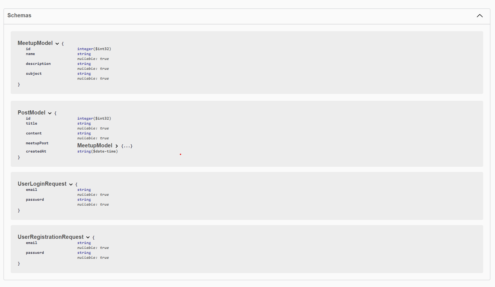

---
title: "Meetup Web Application"
author: [M. Semih Celek, 2018100075]
date: "2022-01-08"
subject: "Meetup .Net Application"
keywords: [.Net, Mysql, Database, React, Entity Framework]
subtitle: "Bogazici University 2022"
lang: "en"
titlepage: true
toc-own-page: true
titlepage-rule-color: "360049"
titlepage-rule-height: 0
titlepage-background: "background1.pdf"
page-background: "background5.pdf"
...

# Introduction

## System Request:

<!-- \chapter{First} -->
<!-- \section{one} -->

**Business Needs**: There is a need for new socials media application that focuses on creating meetups and creating events. This application aims to fulfill this need.

**Business Values**: The new social media application database system will enable users to create meetups and create posts. Also it will have business values throughout advertisement.

### Objective

Aim of the project is to create a new social media application enabling people to organize events. This events can be at both for online, or physical. Also application will enable its users to communicate on meetup basis so that people can stay in touch.

## Application Features

### User Registration Module

The users of meetup application needs to be registered in order to keep track the actions. Users must add their personal information such as (_Name, Surname, Email Address, Password, Telephone Number, Registration Date, Role, etc..._). Business rules for registration module are listed as;

- The fields of Name, Number, ID, Email, Password and Role cannot be null.
- Role of the user must be specified, whether the user is administrator or user.

### Meetup Module

Users can create meetup instances and invite other people to their meetups. Meetups are small group of users who shares a common feed, communication space.

Business rules are listed as;

- Only Users can create Meetups.
- Meetups have their admins.
- Meetup's feed can only be seen by its members, not member User cannot see the inside of a Meetup.
- Users can attend a meetup by its link and can quit anytime.
- Only admins have privilege to manage users(add, subtract)

### Post Module

Users can create their posts like any other platform Posts are the simple way of user the share their ideas. Post consist of _Title, Content, Date, User Reference and ifExist a Meetup Refernce, Comments Ref_.

Business rules are listed as;

- Only Users can create posts.
- Posts can be posted on both meetup events or publicly.
- Posts that are published on meetup instances can only be viewed by those who attends to the meetup.
- Posts can only be edited by it's user.
- Only User's friends or meetup associates can comment the post, others can't comment.

### Searching Module

Searching Module can be used to search both Users, Meetups and Posts. Users of search module can search every instance of the meetup and user by entering its id.

### Application Backend (Restful Api)

Meetup Application is build on .Net Core Model-View-Controller (MVC) architecture. Backend will utilize the core business logic and will be responsible for authentication, authorization and storing the data. Also the Api will be the source of truth (Validating users and their interactions).. Api also will store the data via a solid database and will interact with this database with an Object-Relational-Mapper, and all the dependencies of project, (models views and controllers) will be inverted and maintained by Ioc container/dependency injection framework. Also api might use Entity Framework. 

### Application Frontend/Client (Create React App, React Framework Build)

Application client will be built on react eco-system. It will be Single page application with dynamic react routing. Also it will have react view components which will have their own state. Also I plan to use packages including axios (network query library) formik (handling form inputs) react-router (routing), zustand (redux base state handling library). I haven't decide to UI library. 


To begin with the Restful Api.

The end points of the api are listed as;




The api is built on top of a dotnet entity framework and uses Sql database to persist the data and it's users.

## Api Code Analyze
I want to start with the domain of the objects:

Post Model: 
```csharp
    public class PostModel
    {
        [Key]
        public int Id { get; set; }
        
        public string Title { get; set; }

        public string Content { get; set; }

        public MeetupModel MeetupPost { get; set; }

        public DateTime CreatedAt { get; set; }
    }
```

Meetup Model;

```csharp
    public class MeetupModel
    {
        [Key]
        public int Id { get; set; }
        
        public string Name { get; set; }

        public string Description { get; set; }

        public string Subject { get; set; }
    }
```

These are the main dto's to identity the objects of application and they are stored on domain folder.

Now let's look at the Microsoft entity framework database implementation.

```csharp
    public class DataContext : IdentityDbContext
    {
        public DataContext(DbContextOptions<DataContext> options)
            : base(options)
        {

        }

        public DbSet<PostModel> PostDataContext { get; set; }
        public DbSet<MeetupModel> MeetupDataContext { get; set; }
    }
```

With our models and DbSet types, we can easily generate migration code for desired database, then we run those migration schemes with dotnet-ef commanline tool. Now we have database with tables and relations. Entity Framework really simplifies this process. 

Now let's examine the controllers;

```csharp
 public class PostController : Controller
    {
        // Services of the controllers are abstracted with interfaces and they are injected 
        // in the run time.
        private readonly IPostService _postService;

        public PostController(IPostService postService)
        {
            // Post service dependency is injected. 
            _postService = postService;
        }

        [HttpGet(ApiRouter.Post.GetAll)]
        public async Task<IActionResult> GetAllPosts()
        {
            return Ok(await _postService.GetAllPostsAsync());
        }

        [HttpGet(ApiRouter.Post.Get)]
        public async Task<IActionResult> GetOnePost([FromRoute] int id)
        {
            return Ok(await _postService.GetPostAsync(id));
        }

        [HttpPost(ApiRouter.Post.Create)]
        public async Task<IActionResult> CreatePost([FromBody] PostModel postModel)
        {
            string baseUrl = $"{HttpContext.Request.Scheme}://{HttpContext.Request.Host.ToUriComponent()}";
            string location = baseUrl + "/" + ApiRouter.Post.Get.Replace("{id}", postModel.Title);

            await _postService.CreatePostAsync(postModel);

            return Created(location, postModel);
        }

        [HttpGet(ApiRouter.Post.Delete)]
        public async Task<IActionResult> DeletePost([FromRoute] int id)
        {
            return Ok(await _postService.DeletePostAsync(id));
        }
    }
```

Get & Post request types are used for creating controllers and async methods are adopted for better performance.

Now let's look the IService and Service implementations;

```csharp
    public interface IMeetupService // interface that controllers use.
    {
        Task<List<MeetupModel>> GetAllMeetupAsync();
        Task<MeetupModel> GetMeetupAsync(int id);
        Task<bool> CreateMeetupAsync(MeetupModel meetupModel);
        Task<bool> DeleteMeetupAsync(int id);
    }
```

```csharp
public class MeetupService : IMeetupService // Concrete Service Implementation
    {
        private readonly DataContext _dataContext;

        public MeetupService(DataContext dataContext)
        {
            _dataContext = dataContext;
        }

        public async Task<List<MeetupModel>> GetAllMeetupAsync()
        {
            return await _dataContext.MeetupDataContext.ToListAsync();
        }

        public async Task<MeetupModel> GetMeetupAsync(int id)
        {
            return await _dataContext.MeetupDataContext.FirstOrDefaultAsync(m => m.Id == id);
        }

        public async Task<bool> CreateMeetupAsync(MeetupModel meetupModel)
        {
            await _dataContext.MeetupDataContext.AddAsync(meetupModel);
            var created = await _dataContext.SaveChangesAsync();
            return created > 0;
        }

        public async Task<bool> DeleteMeetupAsync(int id)
        {
            MeetupModel meetupToDelete = await GetMeetupAsync(id);
            _dataContext.MeetupDataContext.Remove(meetupToDelete);
            await _dataContext.SaveChangesAsync();
            return true;
        }
    }
```

With this simple abstaction we can completely decouple services with controllers.

In this project I decided to implement authentication and authorization for user and I did this with using JsonWebToken authentication

Configuration for JWT;

```csharp
    JwtSettings jwtSettings = new JwtSettings();
    configuration.Bind(nameof(jwtSettings),jwtSettings);
            
    services.AddSingleton(jwtSettings);

    services.AddScoped<IIdentityService, IdentityService>();

    services.AddAuthentication(x =>
    {
        x.DefaultAuthenticateScheme = JwtBearerDefaults.AuthenticationScheme;
        x.DefaultScheme = JwtBearerDefaults.AuthenticationScheme;
        x.DefaultChallengeScheme = JwtBearerDefaults.AuthenticationScheme;
    }).AddJwtBearer(x =>
    {
        x.SaveToken = true;
        x.TokenValidationParameters = new TokenValidationParameters
            ValidateIssuerSigningKey = true,
            IssuerSigningKey = new SymmetricSecurityKey(Encoding.ASCII.GetBytes(jwtSettings.Secret)),
            ValidateIssuer = false,
            ValidateAudience = false,
            RequireExpirationTime = false,
            ValidateLifetime = true
        };
    });
```

And User Login and registration service and controllers;

```csharp
public class IdentityService : IIdentityService
    {
        private readonly UserManager<IdentityUser> _userManager;
        private readonly JwtSettings _jwtSettings;

        public IdentityService(UserManager<IdentityUser> userManager, JwtSettings jwtSettings)
        {
            _userManager = userManager;
            _jwtSettings = jwtSettings;
        }

        public async Task<AuthenticationResult> RegisterAsync(string email, string password)
        {
            IdentityUser existingUser = await _userManager.FindByEmailAsync(email);

            if (existingUser is not null)
            {
                return new AuthenticationResult
                {
                    ErrorMessage = "User already exist."
                };
            }

            IdentityUser newUser = new IdentityUser
            {
                Email = email,
                UserName = email
            };

            IdentityResult createdUser = await _userManager.CreateAsync(newUser, password);

            if (!createdUser.Succeeded)
            {
                return new AuthenticationResult
                {
                    ErrorMessage = createdUser.Errors.ToString()
                };
            }

            JwtSecurityTokenHandler tokenHandler = new JwtSecurityTokenHandler();
            byte[] key = Encoding.ASCII.GetBytes(_jwtSettings.Secret);

            SecurityTokenDescriptor tokenDescriptor = new SecurityTokenDescriptor
            {
                Subject = new ClaimsIdentity(new[]
                {
                    new Claim(JwtRegisteredClaimNames.Sub, newUser.Email),
                    new Claim(JwtRegisteredClaimNames.Jti, Guid.NewGuid().ToString()),
                    new Claim(JwtRegisteredClaimNames.Email, newUser.Email),
                    new Claim("id", newUser.Id)
                }),
                Expires = DateTime.UtcNow.AddDays(30),
                SigningCredentials = new SigningCredentials(new SymmetricSecurityKey(key),
                    SecurityAlgorithms.HmacSha256Signature)
            };
            var token = tokenHandler.CreateToken(tokenDescriptor);

            return new AuthenticationResult
            {
                Success = true,
                Token = tokenHandler.WriteToken(token)
            };
        }

        public async Task<AuthenticationResult> LoginAsync(string email, string password)
        {
            IdentityUser user = await _userManager.FindByEmailAsync(email);

            if (user is null)
            {
                return new AuthenticationResult
                {
                    ErrorMessage = "User does not exist"
                };
            }

            bool userHasValidPassword = await _userManager.CheckPasswordAsync(user, password);

            if (!userHasValidPassword)
            {
                return new AuthenticationResult
                {
                    ErrorMessage = "Either username or password is wrong"
                };
            }

            JwtSecurityTokenHandler tokenHandler = new JwtSecurityTokenHandler();
            byte[] key = Encoding.ASCII.GetBytes(_jwtSettings.Secret);

            SecurityTokenDescriptor tokenDescriptor = new SecurityTokenDescriptor
            {
                Subject = new ClaimsIdentity(new[]
                {
                    new Claim(JwtRegisteredClaimNames.Sub, user.Email),
                    new Claim(JwtRegisteredClaimNames.Jti, Guid.NewGuid().ToString()),
                    new Claim(JwtRegisteredClaimNames.Email, user.Email),
                    new Claim("id", user.Id)
                }),
                Expires = DateTime.UtcNow.AddDays(30),
                SigningCredentials = new SigningCredentials(new SymmetricSecurityKey(key),
                    SecurityAlgorithms.HmacSha256Signature)
            };
            SecurityToken token = tokenHandler.CreateToken(tokenDescriptor);

            return new AuthenticationResult
            {
                Success = true,
                Token = tokenHandler.WriteToken(token)
            };
        }
    }
```

Last note, because api and client exist differently, we had to enable Cors to exchange json objects and create connection between client and the api.

## Client Code Analyze

On the client side React Framework and ecosystem is used for creating dynamic application. Routing, Forms, DataFetching and State Management are the main topics of frontend.

Let's Begin with the React-Router;

```js
const Router = () => {
  const user = useUserStore((state) => state.user);
  return (
    <div>
      <BrowserRouter>
        <div>
          <div className="navbar navbar-expand fixed-top navbar-light bg-light">
            <div className="container-fluid">
              <h3 className="display-8 primary">Meetup Application</h3>
              <ul className="navbar-nav">
                <li className="nav-item m-2">
                  <Link to="/" className="navlink display-6" >Home</Link>
                </li>
                <li className="nav-item  m-2">
                  <Link to="/posts" className="navlink display-6">Posts</Link>
                </li>

                // In the here we render different routes if a user token exist.
                {user.token ? (
                  <li className="nav-item  m-2">
                    <Link to="/home" className="navlink display-6">{user.email}</Link>
                  </li>
                ) : (<>
                    <li className="nav-item  m-2">
                      <Link to="/login" className="navlink display-6">Login</Link>
                    </li>
                    <li className="nav-item  m-2">
                      <Link to="/register" className="navlink display-6">Register</Link>
                    </li>
                    </>
                )}
              </ul>
            </div>
          </div>

          <Switch>
            <Route path="/posts/:id">
              <PostPage />
            </Route>
            <Route path="/user/:username">
              <ProfilePage />
            </Route>
            <Route path="/home">
              <UserHomePage />
            </Route>
            <Route path="/register">
              <RegisterPage />
            </Route>
            <Route path="/login">
              <LoginPage />
            </Route>
            <Route path="/">
              <PostsPage />
            </Route>
          </Switch>
        </div>
      </BrowserRouter>
    </div>
  );
};
```

In here, we create register component to enable user registering. Formik library is used to simplify forms.

```js
const Register = () => {
  const history = useHistory();
  const handleSubmit = async (values, { setSubmitting }) => {
    const response = await registerUser(values);
    console.log(response);
    setSubmitting(false);
    if (response) {
      history.push("/");
    }
  };

  return (
    <div className="container mt-5 m-5 p-5 ">
      <h3>Register</h3>
      <Formik
        initialValues={{
          email: "",
          password: "",
        }}
        onSubmit={handleSubmit}
      >
        <Form>
          <label className="form-label" >email:</label>
          <Field className="form-control" name="email" type="email" />

          <label className="form-label">password</label>
          <Field className="form-control" name="password" type="password" />
          <button className="mt-4 btn btn-primary" type="submit">register</button>
        </Form>
      </Formik>
    </div>
  );
};
```

I used the popular fetch library axios to simplify fetching process 

```js
export const registerUser = async (values) => {
  const response = await axios.post(
    `${process.env.REACT_APP_API_URL}/user/register`,
    values
  );
  return response.data;
};
```

Continuing with main page where we display post, we write simple lamda map function to render each post which is requested from the api.
Also, I wrote custom useFetch hook for simplifying the fetching action.

```js
const PostsPage = () => {
  const { data, isloading, error } = useFetch("/post/all");

  return (
    <div className="container-xl p-5">
      <NewPost />
      {isloading ? (
        <div>load...</div>
      ) : (
        data.map((story) => (
          <div className="row" key={story.id}>
            <Post
              id={story.id}
              title={story.title}
              content={story.content}
              author={story.author}
            />
          </div>
        ))
      )}
    </div>
  );
};

// Post Component
const Post = ({ id, title, content, author }) => {
  return (
    <div className="container-sm" >
      <div className="card col">
        <h3 className="card-title" >{title}</h3>
        <p className="card-text" > {content}</p>
        <h6 className="card-subtitle mb-2 text-muted">{author}</h6>
        <button className="btn btn-danger " onClick={() => handleDeleteButtonClick(id)}>delete Post</button>
      </div>
    </div>
  );
};

const handleDeleteButtonClick = async (id) => {
  await deletePost(id);
}

const fetch = async (url) => {
  const response = await axios.get(`${process.env.REACT_APP_API_URL}${url}`);
  console.log(response.data);
  return response.data;
};

export const useFetch = (url) => {
  const { data, error } = useSWR(url, fetch);

  return {
    data: data,
    isloading: !error && !data,
    error: error,
  };
};
```

At the last, in order to manage the application state, I used a state management library called zustand, which is based on Redux. The benefit of zustand over redux is, zustand reduces the boilerplate of redux and eases the use of state management.

Here is user state;


```js
import create from "zustand";
import { devtools } from "zustand/middleware";
import { getLocalUser } from "../services/user-service";

const useUserStore = create(
  devtools((set) => ({
    // calling a function to initialize the state feels wrong, search for it.
    user: getLocalUser(),
    setUser: (user) => set((state) => ({ ...state, user: user })),
    removeUser: () => set({ user: {} }),
  }))
);

export { useUserStore };
```
Also User Service for handling user requests and persistance on the local storage;

```js
import axios from "axios";

export const setToken = (userObj) => {
  const token = `Bearer ${userObj.token}`;
  return token;
};

export const loginUser = async (values) => {
  const response = await axios.post(
    `${process.env.REACT_APP_API_URL}/user/login`,
    values
  );
  console.log(response.data);
  if (response.data) {
    return response.data;
  } else {
    return null;
  }
};

export const registerUser = async (values) => {
  const response = await axios.post(
    `${process.env.REACT_APP_API_URL}/user/register`,
    values
  );
  return response.data;
};

export const getLocalUser = () => {
  const getLocalSavedUser = window.localStorage.getItem("social-app-user");
  if (getLocalSavedUser) {
    const user = JSON.parse(getLocalSavedUser);
    console.log(user);
    return user;
  } else {
    return {};
  }
};

export const saveLocalUser = (userObj) => {
  const saveUser = window.localStorage.setItem(
    "social-app-user",
    JSON.stringify(userObj)
  );
  console.log(saveUser);
};

export const removeSavedUser = () => {
  window.localStorage.removeItem("social-app-user");
};
```

At the final I used Bootstrap 5 css classes for appearance of the application.

# Final Thoughts

Meetup Application project is full stack application which makes use of fully funtional Restful Api that persists its data to realtime database, handles user registarations and logins, dynamicly creates endpoints for unique ids. Client side of the project also lives entirely separate from api and dynamicly comminucates with api to creating unique experience for each user.


