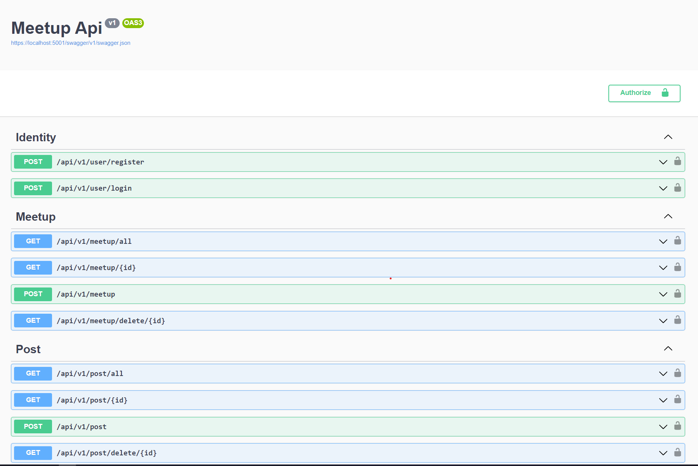

---
title: "Meetup Command Line Application"
author: [M. Semih Celek, 2018100075]
date: "2022-01-08"
subject: "Meetup .Net Application"
keywords: [.Net, Mysql, Database, Command Line]
subtitle: "Bogazici University 2022"
lang: "en"
titlepage: true
toc-own-page: true
titlepage-rule-color: "360049"
titlepage-rule-height: 0
titlepage-background: "background1.pdf"
page-background: "background5.pdf"
...

# Introduction

## System Request:

<!-- \chapter{First} -->
<!-- \section{one} -->

**Business Needs**: There is a need for new socials media application that focuses on creating meetups and creating events. This application aims to fulfill this need.

**Business Values**: The new social media application database system will enable users to create meetups and create posts. Also it will have business values throughout advertisement.

### Objective

Aim of the project is to create a new social media application enabling people to organize events. This events can be at both for online, or physical. Also application will enable its users to communicate on meetup basis so that people can stay in touch.

## Application Features

### User Registration Module

The users of meetup application needs to be registered in order to keep track the actions. Users must add their personal information such as (_Name, Surname, Email Address, Password, Telephone Number, Registration Date, Role, etc..._). Business rules for registration module are listed as;

- The fields of Name, Number, ID, Email, Password and Role cannot be null.
- Role of the user must be specified, whether the user is administrator or user.

### Meetup Module

Users can create meetup instances and invite other people to their meetups. Meetups are small group of users who shares a common feed, communication space.

Business rules are listed as;

- Only Users can create Meetups.
- Meetups have their admins.
- Meetup's feed can only be seen by its members, not member User cannot see the inside of a Meetup.
- Users can attend a meetup by its link and can quit anytime.
- Only admins have privilege to manage users(add, subtract)

### Post Module

Users can create their posts like any other platform Posts are the simple way of user the share their ideas. Post consist of _Title, Content, Date, User Reference and ifExist a Meetup Refernce, Comments Ref_.

Business rules are listed as;

- Only Users can create posts.
- Posts can be posted on both meetup events or publicly.
- Posts that are published on meetup instances can only be viewed by those who attends to the meetup.
- Posts can only be edited by it's user.
- Only User's friends or meetup associates can comment the post, others can't comment.

### Searching Module

Searching Module can be used to search both Users, Meetups and Posts. Users of search module can search every instance of the meetup and user by entering its id.

### Application Backend (Restful Api)

Meetup Application is build on .Net Core Model-View-Controller (MVC) architecture. Backend will utilize the core business logic and will be responsible for authentication, authorization and storing the data. Also the Api will be the source of truth (Validating users and their interactions).. Api also will store the data via a solid database and will interact with this database with an Object-Relational-Mapper, and all the dependencies of project, (models views and controllers) will be inverted and maintained by Ioc container/dependency injection framework. Also api might use Entity Framework. 

### Application Frontend/Client (Create React App, React Framework Build)

Application client will be built on react eco-system. It will be Single page application with dynamic react routing. Also it will have react view components which will have their own state. Also I plan to use packages including axios (network query library) formik (handling form inputs) react-router (routing), zustand (redux base state handling library). I haven't decide to UI library. 


To begin with the Restful Api.

The end points of the api are listed as;




The api is built on top of a dotnet entity framework and uses Sql database to persist the data and it's users.

I want to start with the domain of the objects:

Post Model: 
```csharp
    public class PostModel
    {
        [Key]
        public int Id { get; set; }
        
        public string Title { get; set; }

        public string Content { get; set; }

        public MeetupModel MeetupPost { get; set; }

        public DateTime CreatedAt { get; set; }
    }
```

Meetup Model;

```csharp
    public class MeetupModel
    {
        [Key]
        public int Id { get; set; }
        
        public string Name { get; set; }

        public string Description { get; set; }

        public string Subject { get; set; }
    }
```

These are the main dto's to identity the objects of application. 

